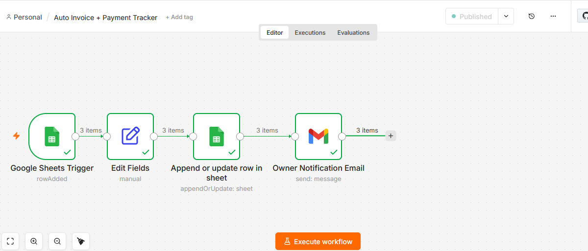

# 🧾 Auto Invoice + Payment Tracker — n8n Automation

## What This Does

I built this because I kept seeing the same problem.

Freelancers and small business owners were spending hours
creating invoices manually.
Copy paste. Format. Send. Track. Repeat.

Every single order.
Every single time.

So I automated the whole thing.

Now when a client fills your order form,
four things happen instantly — without you touching anything:

- A unique invoice number gets generated automatically
- The invoice gets saved to your Google Sheet
- The client receives a professional invoice email
- You get an instant notification about the new order

You focus on your work.
The automation handles the paperwork.

---

## The Problem I Solved

I talked to freelancers, consultants and shop owners.

They all said the same thing.

"I spend 30 minutes creating each invoice manually."
"I forget to follow up because I lose track of orders."
"My clients wait too long to receive their invoice."

One freelancer told me she was losing clients
just because invoices were delayed.

This workflow fixes all of that.
Instant invoice. Instant notification. Zero manual work.

---

## How It Works

No coding. No complicated setup.
Just a clean professional system that works every time.

Step 1 — Client fills your order form
Name. Email. Service. Amount. Submitted.

Step 2 — Google Sheets Trigger wakes up n8n
The moment a new row appears in the sheet,
n8n starts working automatically.

Step 3 — Invoice details get generated
Unique invoice number created automatically.
Date added automatically.
Status set to Pending Payment.

Step 4 — Invoice saves to Google Sheet
All details recorded permanently.
You can see every order anytime, anywhere.

Step 5 — Client receives professional invoice email
Name. Service. Amount. Invoice number. Due date.
Everything they need. Instantly.

Step 6 — You get a notification
New order arrived in your inbox.
Client details ready for follow up.

The whole process takes less than 5 seconds.
Every single time.

---

## Workflow Screenshot



---

## Flow Diagram

```
Client Fills Order Form
        ↓
Google Sheets Trigger
        ↓
Generate Invoice No + Date + Status
        ↓
Send Invoice Email to Client
        ↓
Update Google Sheet
        ↓
Notify Owner
        ↓
Done ✅
```

---

## The Nodes I Used

### Node 1 — Google Sheets Trigger
Watches the order form responses sheet 24/7.
The moment a client submits the form,
this node wakes up and starts the invoice process.
Think of it as your order bell.
Silent. Always on. Never misses a submission.

### Node 2 — Edit Fields
Generates all the invoice details automatically.
Unique Invoice Number using client name and timestamp.
Current date formatted cleanly.
Payment status set to Pending Payment.
No manual input needed. Ever.

### Node 3 — Gmail (Invoice to Client)
Sends a professional invoice email to the client instantly.
Invoice number. Service. Amount. Due date. Everything included.
Client feels valued. Client trusts you. Client pays faster.

### Node 4 — Google Sheets (Update Row)
Updates the sheet with invoice number, date and status.
Every order permanently recorded.
Full payment history always available.
Open your sheet anytime and see every order ever received.

### Node 5 — Gmail (Notify Owner)
Sends you an instant notification.
New order details arrive in your inbox immediately.
You know every time money is coming in.
No checking. No waiting. Just instant awareness.

---

## Google Sheet Structure

| Timestamp | Client Name | Email | Service | Amount | Invoice No | Date | Status |
|-----------|-------------|-------|---------|--------|------------|------|--------|
| 2026-06-05 | John Smith | john@email.com | Logo Design | 500 | INV-john-20260605162134 | 2026-06-05 | Pending Payment |
| 2026-06-05 | Sarah Lee | sarah@email.com | SEO | 300 | INV-sarah-20260605163022 | 2026-06-05 | Pending Payment |

---

## What I Learned Building This

I want to be completely honest about the mistakes I made.
Because buyers deserve to know I have already solved the hard problems.

Mistake 1 — All invoices had the same Invoice Number.
I used timestamp only.
Two orders in the same second got the same number.
Fix: Combined client email username and timestamp together.
Now every invoice number is truly unique. Forever.

Mistake 2 — Invoice details were not saving to the Sheet.
I thought Google Sheets Trigger would write data back.
It does not. It only reads.
Fix: Added a separate Google Sheets Update Row node.
Now Invoice No, Date and Status all save perfectly.

Mistake 3 — Expressions were showing undefined.
Google Form field names have spaces.
I used the wrong expression format.
Fix: Fields with spaces need {{ $json['Field Name'] }} format.
Fields without spaces use {{ $json.fieldname }} format.

Every mistake I made, I fixed.
So you never have to face them.

---

## Who Needs This

- Freelancers tired of creating invoices manually every day
- Consultants losing track of client payments and orders
- Small business owners who want to look more professional
- Agencies handling multiple client orders simultaneously
- Anyone who has ever forgotten to send an invoice

---

## Real Questions From Real Buyers

**Can I customize the invoice email with my business name?**
Yes. One click. Change any text you want in under 30 seconds.

**Does this track payment status?**
Yes. Every order saved with Pending Payment status automatically.
You update it to Paid manually when payment arrives.

**Can I add my business logo to the invoice?**
Yes. I can add HTML formatting to make it look fully professional.

**What if a client submits the form twice?**
Each submission creates a new unique invoice number.
No duplicates. No confusion. Ever.

**What if I have multiple services with different prices?**
Yes. The form captures whatever service and amount the client enters.
Fully flexible for any business type.

**Do I need coding knowledge?**
Zero. Completely no code required.

**How long does setup take?**
Under 20 minutes from start to finish.

**Is this a one time setup?**
Yes. Set it up once. It runs forever.

---

## Download & Import Workflow

You can import this workflow directly into your n8n.

1. Download the file here: Go json folder
2. Open n8n
3. Click Import Workflow
4. Upload the JSON file
5. Add your Gmail and Google Sheets credentials
6. Connect your Google Form to your Sheet
7. Publish and you are live

---

## What I Built This With

- n8n — workflow automation (free at n8n.io)
- Google Forms — client order collection
- Google Sheets — invoice and payment database
- Gmail API — invoice delivery and owner notifications

This entire workflow runs without spending a single dollar.

---

## 💰 Hire Me — Pricing

I do not just send you a JSON file.
I set everything up completely for your business.
Your form. Your invoice. Your email. Your sheet.
Tested. Live. Working.

| Package | Price | What You Get |
|---------|-------|-------------|
| **Basic** | $30 | Full workflow setup + Google Sheet + invoice email + tested + live |
| **Standard** | $50 | Everything in Basic + custom invoice design + payment reminder email + 3 days support |
| **Premium** | $80 | Everything in Standard + payment status tracking dashboard + 2 extra customizations + 7 days support |

---

## Why Work With Me

I show my full work right here on GitHub.
Every node. Every step. Every decision.
I even show the mistakes I made and exactly how I fixed them.
Nothing hidden. Nothing vague.

You can see exactly how I build before you spend a single dollar.

No surprises. No hidden steps. No confusion.
Just clean professional automation delivered with care.

---

## Ready To Get Started?

Message me on Fiverr or Upwork.
Tell me about your business and how you currently handle invoices.
I will set up a system that saves you hours every single week.

Response time: under 2 hours.

I look forward to working with you.
